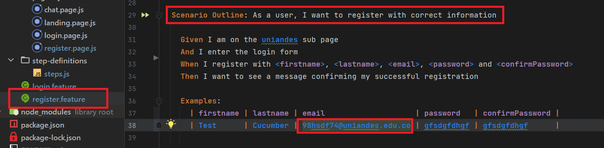

# cypress-monkey

## Versiones usadas
- node 14.20.1
- wdio/cli ^7.26.0
- cucumber-framework ^7.26.0

## Sistema operativo
- Windows 11 Home Single Language 22H2 64 bits

## Intalación
Clonar el proyecto con el comando `git clone https://github.com/luissanta/cucumber-students.git`
- Entrar al proyecto con el comando `cd cucumber-students`
- Ejecutar el comando `npm i` para la instalación de las dependencias y paquetes necesarios.

## Correr
- Ejecutar el comando `npm run wdio` para iniciar los test.
- Se abrira automaticamente el navegador de chrome y ejecutara los test.

# Nota importante
El test especifico de registar una cuenta nueva solo funcionara una vez, puesto que cuando se corra de nuevo, esta cuenta ya sera existente y el test fallara, para ajustar en cada iteracion se debe cambiar el email especificado para esta prueba que se encuentra en el archivo `register.feature` 

